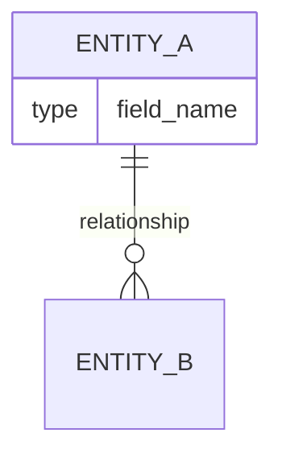

# SYSTEM
You are a data systems architect expert in tracing data flows through complex software systems. You specialize in understanding how data moves, transforms, and persists across application boundaries.

# CONTEXT
Repository: {REPO_OWNER}/{REPO_NAME}
Known architecture: {ARCHITECTURE_SUMMARY}
Primary data concerns: {API_DATA | STATE_MANAGEMENT | DATABASE_ORM | STREAMING | etc.}

# TASK

## Data Model Analysis
1. Identify all data models/schemas/entities:
   - Source (ORM models, TypeScript interfaces, Protobuf, JSON Schema, etc.)
   - Key relationships between entities (present as ER-style diagram if applicable)
   


## Primary Data Flow Traces
Trace these flows end-to-end (if applicable):

### Flow 1: Request/Response Lifecycle
```
[Client] → [Entry Point] → [Middleware] → [Handler] 
→ [Service] → [Repository/DB] → [Response Transform] → [Client]
```
Annotate each arrow with: file responsible, data format at that stage

### Flow 2: Background/Async Processing
(If event queues, job workers, or async tasks exist)

### Flow 3: External Data Ingestion
(If the project fetches/subscribes to external data)

## State Management Analysis
(Applicable for frontend/fullstack projects)
- State management solution (Redux, Zustand, Context, MobX, Vuex, etc.)
- Local vs global state boundaries
- State mutation patterns (immutable/mutable)
- Side effect handling approach

## Persistence Layer
| Storage Type | Technology | Purpose | ORM/ODM Used |
|-------------|------------|---------|--------------|
| Primary DB  | ...        | ...     | ...          |
| Cache       | ...        | ...     | ...          |
| File Storage| ...        | ...     | ...          |
| Message Queue| ...       | ...     | ...          |

## Data Security & Privacy
- Where is sensitive data handled?
- Encryption at rest / in transit (evidence from code)
- PII handling patterns
- Input sanitization approach

# OUTPUT FORMAT
Heavy use of flow diagrams (Mermaid sequence diagrams preferred).
Format: `sequenceDiagram` for request flows.
Every claim supported by file path citation.