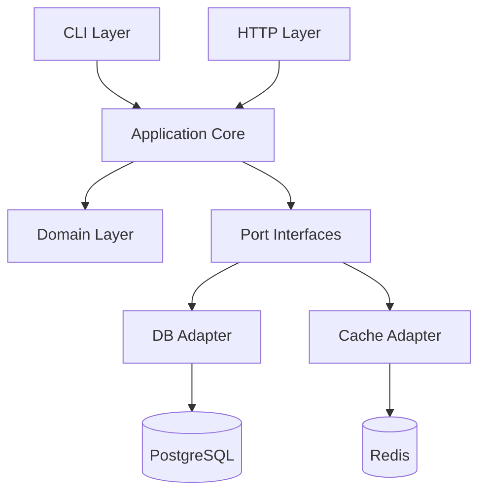
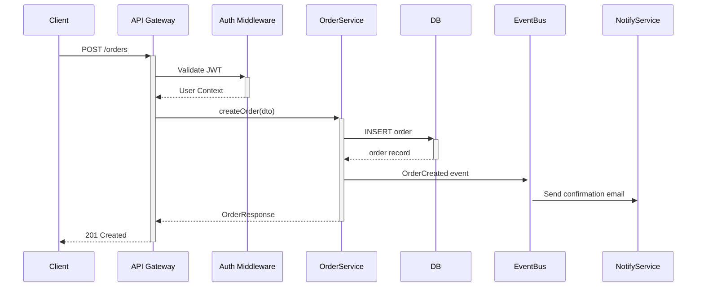

# [{项目名称}] 开源项目深度研究报告

**仓库：** https://github.com/{owner}/{repo}  
**研究日期：** {YYYY-MM-DD}  
**报告版本：** v1.0  
**研究者：** {name/agent}

---

## 📋 执行摘要（Executive Summary）
> 面向决策者，500字以内，非技术语言

- **项目是什么：** 一句话定义
- **解决什么问题：** 核心价值主张
- **技术成熟度：** ⭐⭐⭐⭐☆
- **适用场景：** 3个典型场景
- **推荐指数：** 使用 / 贡献 / 生产部署
- **最大亮点：** TOP 3
- **主要风险：** TOP 3

---

## 🏷️ 第一章：项目身份与定位

### 1.1 基本信息
| 指标 | 值 |
|------|-----|
| 开源协议 | MIT / Apache 2.0 / GPL... |
| 主语言 | TypeScript (78%) / Python (22%) |
| 最新版本 | v3.2.1 (2025-11-20) |
| Stars | 42.3k |
| 贡献者 | 387 |
| 上次提交 | 3 天前 |

### 1.2 问题域分析
[详细描述项目解决的核心问题]

### 1.3 同类项目对比
| 维度 | 本项目 | 竞品A | 竞品B |
|------|--------|-------|-------|
| 性能 | ... | ... | ... |
| 学习曲线 | ... | ... | ... |

---

## 🔧 第二章：技术栈全景

### 2.1 技术栈速览
```
运行时:   Node.js 20+ / Python 3.11+
框架:     Express 4.x / FastAPI 0.100+
数据库:   PostgreSQL 15 + Redis 7
构建:     Vite 5 / esbuild
测试:     Vitest + Playwright
部署:     Docker + Kubernetes
CI/CD:    GitHub Actions
```

### 2.2 依赖风险评估
| 依赖 | 版本 | 状态 | 风险 |
|------|------|------|------|
| lodash | 4.17.21 | ✅ 最新 | 低 |
| express | 4.18.0 | ⚠️ 落后2个版本 | 中 |

---

## 🗂️ 第三章：仓库结构

### 3.1 目录树（注释版）
```
{repo-root}/
├── src/                    # 核心源码
│   ├── core/               # 框架核心，不依赖业务
│   ├── modules/            # 业务功能模块
│   ├── shared/             # 跨模块共享工具
│   └── index.ts            # 程序主入口
├── tests/                  # 测试代码
│   ├── unit/               # 单元测试
│   ├── integration/        # 集成测试
│   └── e2e/                # 端到端测试
├── docs/                   # 文档
├── scripts/                # 构建/部署脚本
├── .github/workflows/      # CI/CD 配置
├── docker-compose.yml      # 本地开发环境
├── package.json            # 依赖与脚本定义
└── README.md               # 项目说明
```

### 3.2 入口点地图
| 入口类型 | 文件路径 | 说明 |
|---------|---------|------|
| HTTP Server | `src/index.ts:main()` | 主服务启动 |
| CLI | `src/cli/index.ts` | 命令行工具入口 |
| Library Export | `src/lib/index.ts` | 库模式导出 |

---

## 🏛️ 第四章：架构设计

### 4.1 架构模式识别
**主要模式：** 六边形架构（Hexagonal Architecture）  
**证据：** `src/core/ports/` 目录定义所有端口接口，`src/adapters/` 实现具体适配器

### 4.2 模块依赖关系图


### 4.3 层次架构分析
| 层 | 目录 | 职责 | 依赖方向 |
|----|------|------|---------|
| 表现层 | `src/http/` | 路由、请求解析 | → 应用层 |
| 应用层 | `src/app/` | 用例编排 | → 领域层 |
| 领域层 | `src/domain/` | 业务规则 | 无外部依赖 |
| 基础设施层 | `src/infra/` | DB/Cache/外部API | → 领域接口 |

---

## ⚙��� 第五章：核心功能解析

### 5.1 功能矩阵
| 功能 | 重要性 | 实现文件 | 完成度 |
|------|--------|---------|--------|
| 用户认证 | 🔴 核心 | `src/modules/auth/` | ✅ 完整 |
| 数据导出 | 🟡 重要 | `src/modules/export/` | ⚠️ 部分 |
| 实时通知 | 🟢 增强 | `src/modules/notify/` | ✅ 完整 |

### 5.2 核心功能 #1：{功能名} 实现解析

**调用链：**
```
HTTP POST /api/auth/login
  └── AuthController.login()          [src/http/auth.controller.ts:45]
      └── AuthService.authenticate()  [src/app/auth.service.ts:23]
          ├── UserRepository.findByEmail()  [src/infra/db/user.repo.ts:67]
          └── JwtService.sign()            [src/infra/jwt/jwt.service.ts:12]
```

**关键代码片段：**
```typescript
// src/app/auth.service.ts:23
async authenticate(email: string, password: string): Promise<AuthToken> {
  const user = await this.userRepo.findByEmail(email);
  if (!user || !await bcrypt.compare(password, user.passwordHash)) {
    throw new UnauthorizedException('Invalid credentials');
  }
  return this.jwtService.sign({ sub: user.id, role: user.role });
}
```

**设计决策：** 使用 bcrypt 而非 argon2，兼容旧版本 Node.js  
**潜在问题：** 未实现速率限制，暴力破解风险 ⚠️

---

## 🌊 第六章：数据流与状态管理

### 6.1 核心数据模型
```mermaid
erDiagram
    USER ||--o{ ORDER : "places"
    USER { string id, string email, enum role }
    ORDER ||--|{ ITEM : "contains"
    ORDER { string id, enum status, datetime createdAt }
    ITEM { string id, int quantity, float price }
```

### 6.2 主请求时序图


---

## 📊 第七章：工程质量评估

### 7.1 工程实践评分卡

| 维度 | 评分 | 证据 |
|------|------|------|
| 代码风格一致性 | ✅ 优秀 | ESLint + Prettier 配置完整 |
| 类型安全 | ✅ 优秀 | TypeScript strict 模式开启 |
| 测试覆盖 | ⚠️ 一般 | 约 65% 覆盖率，E2E 测试稀少 |
| CI/CD | ✅ 优秀 | 完整的 GitHub Actions 流水线 |
| 文档质量 | ⚠️ 一般 | API 文档自动生成，架构文档缺失 |
| 安全实践 | ✅ 良好 | Dependabot 已配置，无硬编码密钥 |
| 社区健康 | ✅ 优秀 | Issue 模板、PR 模板、行为准则齐全 |

**综合质量评分：** 🌟🌟🌟🌟☆ (4/5)

---

## 🚀 第八章：部署与运维指南

### 8.1 快速启动（开发环境）
```bash
# 前置条件：Node.js 20+, Docker Desktop
git clone https://github.com/{owner}/{repo}
cd {repo}
cp .env.example .env          # 配置环境变量
docker-compose up -d          # 启动依赖服务
npm install
npm run dev                   # 启动开发服务器
# 访问 http://localhost:3000
```

### 8.2 配置项参考
| 变量名 | 类型 | 默认值 | 必须 | 说明 |
|--------|------|--------|------|------|
| DATABASE_URL | string | - | ✅ | PostgreSQL 连接串 |
| JWT_SECRET | string | - | ✅ | JWT 签名密钥（>= 32字符） |
| REDIS_URL | string | redis://localhost:6379 | ❌ | Redis 连接串 |
| PORT | number | 3000 | ❌ | HTTP 监听端口 |

### 8.3 生产部署方案对比
| 方案 | 复杂度 | 适用规模 | 文档完整度 |
|------|--------|---------|-----------|
| Docker Compose | 低 | 小型 | ✅ 完整 |
| Kubernetes | 高 | 大型 | ⚠️ 部分 |
| Railway/Render | 低 | 小中型 | ✅ 完整 |

---

## 📚 第九章：学习路径与贡献指南

### 9.1 前置知识要求
**必备：** TypeScript, REST API 设计, SQL 基础  
**推荐：** DDD 概念, Docker 基础, 六边形架构

### 9.2 分阶段学习路线
```
Week 1-2 【定向】
  → 读 README + docs/getting-started.md
  → 跑通本地环境
  → 运行所有测试，观察输出

Week 3-4 【理解核心】
  → 读 src/domain/ （领域模型）
  → 追踪一个完整请求链路
  → 读 tests/integration/ 理解功能边界

Week 5-6 【深入模块】
  → 选一个感兴趣的 module 深入阅读
  → 尝试修改一个小功能，跑通测试
  → 阅读 CONTRIBUTING.md

Week 7+ 【贡献】
  → 认领 "good first issue"
  → 提交第一个 PR
```

### 9.3 推荐的代码阅读顺序
1. `src/domain/entities/` — 理解核心数据概念
2. `src/app/use-cases/` — 理解业务逻辑
3. `src/http/controllers/` — 理解对外接口
4. `src/infra/` — 理解基础设施实现
5. `tests/integration/` — 验证你的理解

---

## 🔍 附录

### A. 已知问题���局限
- Issue #234: 高并发下内存泄漏风险
- 缺少 OpenTelemetry 可观测性支持
- Windows 开发环境存在路径兼容性问题

### B. 相关资源
| 资源 | 链接 |
|------|------|
| 官方文档 | https://... |
| 社区 Discord | https://... |
| 作者博客文章 | https://... |

### C. 报告置信度说明
| 章节 | 置信度 | 说明 |
|------|--------|------|
| 架构分析 | 🟢 高 | 基于代码直接分析 |
| 性能评估 | 🟡 中 | 基于代码模式推断，未实测 |
| 团队动态 | 🔴 低 | 仅基于公开 GitHub 数据 |