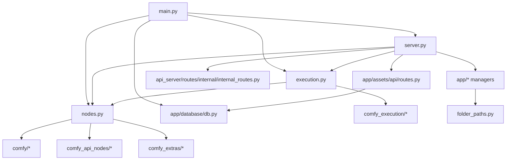
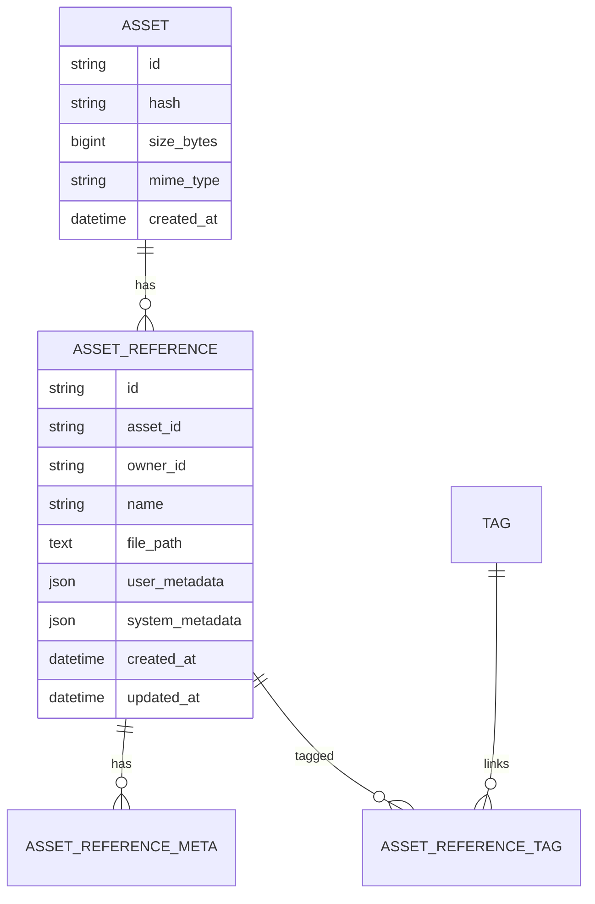
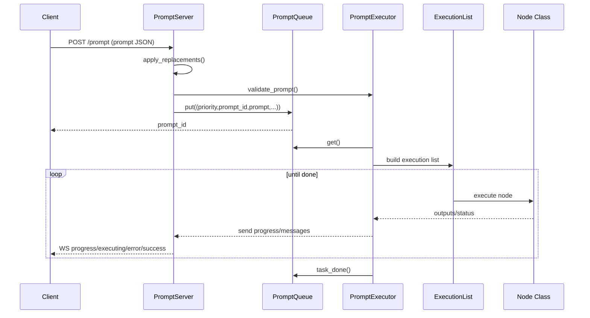

# ComfyUI 0.18.2 开源项目深度研究报告

**仓库**: https://github.com/Comfy-Org/ComfyUI  
**研究日期**: 2026-04-01  
**报告版本**: v1.0  
**研究者**: Codex

---

## 执行摘要

ComfyUI 是一个以图节点工作流为核心的视觉 AI 执行引擎，目标是把扩散模型、多模态模型、模型文件管理、任务队列和可视化工作流编辑整合到同一个 Python 应用中。它既是一个本地 GUI 应用后端，也是一个可编程执行内核，还在近期明显向“资产管理 + 作业系统 + API 节点市场”扩展。

从代码结构看，ComfyUI 不是典型的 MVC Web 项目，而是“推理执行引擎 + aiohttp 服务层 + 节点/插件生态 + 文件系统/模型目录约定”的组合体。核心能力集中在 `execution.py`、`comfy_execution/`、`nodes.py`、`server.py`、`folder_paths.py` 这几条主线，围绕它们又挂接了资产数据库、模型浏览、子图模板、自定义节点国际化、内部前端接口等管理模块。它的系统设计明显服务于两个目标：一是尽量降低用户拼装复杂生成链路的门槛；二是通过缓存、按需执行、异步节点、任务队列来降低重复推理成本。

项目成熟度可判定为“活跃且面向生产使用的稳定项目”，不是实验性仓库。证据包括：明确的周发布节奏、稳定版本号 `0.18.2`、独立的单元测试与推理测试目录、跨平台 CI、数据库迁移和文件锁机制、独立前端包/模板包/嵌入文档包、以及大量围绕用户运行时问题的命令行参数设计（`pyproject.toml:1-5`、`README.md` 的 Release Process 段、`comfy/cli_args.py:38-239`、`.github/workflows/test-unit.yml`、`.github/workflows/test-ci.yml`）。

对使用者而言，ComfyUI 的最大亮点有三点。第一，节点式图执行模型很强，核心执行器只重跑变化部分，并把节点级缓存、图验证、输出历史和进度推送打通了（`README.md` Features 段；`execution.py:719-760`；`comfy_execution/graph.py:194-337`）。第二，扩展点成熟，自定义节点既支持传统 `NODE_CLASS_MAPPINGS` 方式，也支持较新的 `comfy_entrypoint -> ComfyExtension` 方式，还允许扩展前端静态资源、工作流模板和本地化资源（`nodes.py:2207-2296`、`app/custom_node_manager.py:34-145`、`app/subgraph_manager.py:75-132`）。第三，项目正在逐步从“纯推理 UI”升级为“带资产管理和作业 API 的本地 AI 平台”，这在 `app/assets/`、`/api/jobs`、SQLite + Alembic 迁移里体现得很明显（`main.py:369-395`、`app/database/db.py:99-190`、`server.py:756-877`）。

主要风险也很清楚。第一，代码体量高度集中在少数超大文件，如 `nodes.py`、`execution.py`、`server.py`，模块边界并不总是干净，演进成本较高。第二，README 的部分前端说明已经落后于当前实现，例如 README 还说本仓库托管编译后的 `web/` 前端，但当前运行时实际上依赖 `comfyui-frontend-package`，本仓库中也没有顶层 `web/` 目录（`README.md` Frontend Development 段；`requirements.txt:1-3`；`app/frontend_management.py:205-223`）。第三，项目对本地文件系统、模型目录和运行环境耦合很深，跨平台虽支持广，但运维复杂度仍明显高于普通 Web 应用（`folder_paths.py:16-58`、`README.md` 安装与 GPU 段落、`comfy/cli_args.py:38-239`）。

综合判断：如果目标是研究节点式生成工作流引擎、构建 ComfyUI 扩展、或者理解本地 AI 图执行系统，ComfyUI 是非常值得深读的代码库；如果目标是快速二次开发成企业级多租户云平台，则需要补足更严格的模块隔离、文档治理和服务化边界。

---

## 第一章：项目身份与定位

### 1.1 基本信息

| 指标 | 结论 | 证据 |
|------|------|------|
| 项目名称 | ComfyUI | `README.md` 标题；`pyproject.toml:1-4` |
| 当前版本 | 0.18.2 | `pyproject.toml:1-5`；`comfyui_version.py:1-3` |
| 开源协议 | GPL-3.0 | `LICENSE` 开头；GitHub 仓库页显示 GPL-3.0 |
| 主语言 | Python 为绝对主导 | GitHub 仓库页显示 Python 99.5%；源码结构也支持这一判断 |
| 运行形态 | 本地 GUI 后端 + API 服务 + 图执行引擎 | `main.py:397-458`；`server.py:198-239` |
| 发布节奏 | 周期性稳定发布 | `README.md` Release Process 段；GitHub Releases 页面 |

### 1.2 项目解决什么问题

ComfyUI 解决的是“复杂视觉 AI 工作流如何以可视化、可复用、可扩展、低重复计算成本的方式运行”的问题。README 直接将其定义为 graph/nodes/flowchart based interface，并强调只重跑变化部分、异步队列系统、智能显存管理、离线运行和大量模型支持（`README.md` Features 段）。  

从代码层面，这个目标被拆成了几项核心能力：

1. 用图结构表达工作流并验证依赖是否合法。
2. 将节点映射到 Python 类并动态注册扩展节点。
3. 基于拓扑排序和缓存执行图。
4. 通过 aiohttp + WebSocket 向前端暴露队列、进度、历史和对象定义。
5. 用约定式文件夹组织模型、输入、输出、临时文件和用户目录。

### 1.3 目标用户

| 用户类型 | 典型诉求 | 证据 |
|------|------|------|
| 非代码型 AI 创作者 | 拖拽节点、保存工作流、加载模型 | `README.md` Features 段 |
| 高级工作流玩家 | 局部重跑、复杂多节点编排、自定义节点 | `README.md`；`nodes.py:2207-2296` |
| 插件/节点开发者 | 自定义节点、前端扩展、本地化、子图模板 | `app/custom_node_manager.py:34-145`；`app/subgraph_manager.py:75-132` |
| 平台集成者 | 调用 `/prompt`、`/queue`、`/history`、`/api/jobs` | `server.py:687-905`、`server.py:906-1029` |

### 1.4 成熟度判断

我将其评为“稳定且高速演进中的成熟项目”。

证据：

- 发布版本明确，且有稳定周发布说明（`pyproject.toml:1-5`；README Release Process）。
- GitHub 仓库页显示 `107k` stars、`12.4k` forks、`132` 个 releases，最新 release 为 `v0.18.2`，发布时间为 2026-03-25（GitHub 仓库页与 Releases 页）。
- 代码包含数据库迁移、前端版本检查、测试矩阵、文件锁、防止 stale frontend chunks 的发布记录，说明已经过多轮工程化演进（`app/database/db.py:134-187`；`.github/workflows/test-unit.yml`；`.github/workflows/test-ci.yml`）。

### 1.5 同类项目简对比

| 维度 | ComfyUI | 典型单页 AI WebUI | 典型推理 SDK |
|------|---------|------------------|-------------|
| 交互模型 | 节点图 | 表单/标签页 | 代码 API |
| 扩展方式 | 自定义节点 + API 节点 + 前端扩展 | 插件有限 | 代码级扩展 |
| 复用粒度 | 子图、模板、节点级缓存 | 页面级参数复用 | 函数/类复用 |
| 学习曲线 | 中高 | 低 | 中 |
| 系统可组合性 | 很强 | 中 | 很强但不直观 |

---

## 第二章：技术栈全景

### 2.1 技术栈速览

```text
语言:        Python
Web 框架:    aiohttp
计算框架:    PyTorch / torchvision / torchaudio
模型生态:    transformers / tokenizers / sentencepiece / safetensors
配置与校验:  argparse / pydantic / pydantic-settings
数据库:      SQLite + SQLAlchemy + Alembic
图像/媒体:   Pillow / av / scipy
前端分发:    comfyui-frontend-package
模板/文档:   comfyui-workflow-templates / comfyui-embedded-docs
测试:        pytest
CI:          GitHub Actions + 自托管 GPU Runner
```

证据见 `requirements.txt:1-31`、`pyproject.toml:1-45`、`server.py:23-24`、`app/database/db.py:13-25`、`.github/workflows/test-unit.yml`、`.github/workflows/test-ci.yml`。

### 2.2 关键依赖判断

| 技术 | 版本/约束 | 作用 | 风险 |
|------|-----------|------|------|
| Python | `>=3.10` | 主运行时 | 低，README 说明 3.13 支持最好，3.14 有兼容风险 |
| PyTorch | 未锁定版本 | 核心推理执行 | 中，功能受 CUDA/ROCm/XPU 版本影响大 |
| aiohttp | `>=3.11.8` | HTTP/WebSocket 服务 | 低 |
| SQLAlchemy + Alembic | 未锁定 | 本地数据库与迁移 | 中，功能已开始依赖 DB |
| pydantic `~=2.0` | 非核心依赖标记 | 配置/输入校验 | 低到中 |
| comfyui-frontend-package | `1.41.21` | 前端静态资源分发 | 中，前后端版本对齐很关键 |

### 2.3 当前工程实践信号

- 有 Ruff 与 Pylint 配置，但未见 mypy 等静态类型检查链路（`pyproject.toml:11-45`）。
- 使用 pytest 作为统一测试框架，分为 `tests/` 和 `tests-unit/` 两个层次（`tests/README.md`、`tests-unit/README.md`）。
- 对数据库使用 Alembic 迁移和文件锁，说明本地持久化已不是附属功能，而是正式工程面能力（`app/database/db.py:53-190`）。
- 前端不再内嵌源码，而是通过 pip 包和 GitHub release 下载机制管理（`app/frontend_management.py:205-223`、`app/frontend_management.py:326-391`）。

---

## 第三章：仓库结构与入口点

### 3.1 顶层结构图

```text
ComfyUI/
├─ .github/                # CI/CD 与发布流水线
├─ alembic_db/             # 数据库迁移脚本
├─ api_server/             # /internal 子应用与内部前端接口
├─ app/                    # 资产、前端管理、模型浏览、子图等应用层管理模块
├─ blueprints/             # 官方蓝图/模板子图 JSON
├─ comfy/                  # 推理底层与模型实现
├─ comfy_api/              # 公共 API/IO 类型与版本层
├─ comfy_api_nodes/        # 在线服务型 API 节点
├─ comfy_execution/        # 图、验证、缓存、任务辅助
├─ comfy_extras/           # 额外节点实现
├─ custom_nodes/           # 用户自定义节点目录
├─ input/ output/ models/  # 输入、输出、模型目录约定
├─ tests/                  # 推理/集成/执行测试
├─ tests-unit/             # 纯单元测试
├─ main.py                 # 启动入口
├─ server.py               # aiohttp 服务与路由
├─ execution.py            # 队列执行、节点调度、运行时消息
├─ nodes.py                # 内置节点注册与扩展节点加载
├─ folder_paths.py         # 模型/输入/输出目录索引
└─ pyproject.toml          # 项目元数据与静态检查配置
```

顶层目录和文件均可在仓库页与本地结构中直接对应（GitHub 仓库页目录列表；本地目录扫描结果）。

### 3.2 关键入口点

| 类型 | 文件 | 作用 |
|------|------|------|
| 进程主入口 | `main.py:397-458`、`main.py:461-483` | 初始化事件循环、PromptServer、扩展节点、数据库、工作线程 |
| HTTP/WebSocket 服务 | `server.py:198-239`、`server.py:1219-1254` | 创建 aiohttp 应用、WebSocket、静态页面与 API |
| 图执行内核 | `execution.py:701-760` | 处理 prompt 执行生命周期 |
| 节点注册入口 | `nodes.py:2207-2296`、`nodes.py:2487-2499` | 加载内置节点、custom nodes、API nodes |
| 目录配置入口 | `folder_paths.py:16-58` | 定义默认模型与文件目录 |

### 3.3 关键配置文件

| 文件 | 作用 |
|------|------|
| `pyproject.toml` | 项目元数据、Python 版本、lint 配置 |
| `requirements.txt` | 运行依赖 |
| `alembic.ini` | 数据库迁移配置 |
| `extra_model_paths.yaml.example` | 外部模型路径扩展配置 |
| `pytest.ini` | pytest 配置 |
| `.github/workflows/*.yml` | 测试、发布与版本自动化 |

---

## 第四章：架构设计分析

### 4.1 架构模式识别

ComfyUI 更接近“模块化单体 + 图执行引擎 + 插件架构 + Web 网关”。

#### 主要证据

- `main.py:418-436` 先实例化 `PromptServer`，再初始化扩展节点、数据库、路由、进度钩子和后台 worker，说明所有能力仍聚合于单进程。
- `server.py:198-239` 在一个 aiohttp `web.Application` 内挂载用户管理、模型浏览、资产、内部前端路由和扩展静态资源。
- `execution.py:704-760` 与 `comfy_execution/graph.py:194-337` 展示了明确的图执行内核，与 Web 层相对独立。
- `nodes.py:2207-2296` 与 `nodes.py:2487-2499` 则体现出强插件化扩展模型。

#### 为什么会这样设计

这种设计很适合 ComfyUI 的产品目标：

- 单体进程降低本地部署门槛。
- 图执行内核可直接访问 PyTorch、文件系统与模型缓存，避免 RPC 成本。
- 插件层让社区贡献新节点而不必改核心。
- aiohttp 层负责把执行器暴露给 GUI 与 API 调用方。

### 4.2 概念架构图

```text
┌──────────────────────────┐
│ Frontend / Client        │
│ Browser / Desktop / API  │
└─────────────┬────────────┘
              │ HTTP + WS
┌─────────────▼────────────┐
│ PromptServer (aiohttp)   │
│ routes, ws, queue, files │
└───────┬────────┬─────────┘
        │        │
        │        ├──────────────┐
        │        │              │
┌───────▼──────┐ ┌▼────────────┐ ┌▼─────────────────┐
│ execution.py │ │ app/*       │ │ api_server/*     │
│ queue/worker │ │ assets etc. │ │ internal routes  │
└───────┬──────┘ └──────┬──────┘ └──────────────────┘
        │               │
┌───────▼───────────────────────────────────────────┐
│ comfy_execution/*                                 │
│ graph / validation / caching / jobs / progress   │
└───────┬───────────────────────────────────────────┘
        │
┌───────▼────────┐
│ nodes.py       │
│ built-in nodes │
│ custom nodes   │
│ api nodes      │
└───────┬────────┘
        │
┌───────▼───────────────────────────────┐
│ comfy/* + models/ + folder_paths.py   │
│ torch runtime, samplers, model files  │
└───────────────────────────────────────┘
```

### 4.3 Mermaid 模块依赖图



### 4.4 分层分析

| 层 | 目录/文件 | 职责 | 违反点/耦合点 |
|----|-----------|------|--------------|
| 表现层 | `server.py`, `api_server/` | HTTP、WS、静态页面、内部前端 API | 直接了解执行队列和资产细节，层间耦合偏高 |
| 应用层 | `app/` | 资产、模型管理、前端管理、子图、节点替换 | 与 `folder_paths`、`server`、数据库直接耦合 |
| 执行层 | `execution.py`, `comfy_execution/` | prompt 校验、拓扑调度、缓存、进度、作业归档 | 与 `nodes.py`、`server.py` 双向语义耦合 |
| 领域/能力层 | `nodes.py`, `comfy_extras/`, `comfy_api_nodes/` | 节点语义、模型加载、API 节点 | 节点注册中心过大，成为热点耦合点 |
| 基础设施层 | `comfy/`, `folder_paths.py`, `app/database/db.py` | 模型推理、目录系统、数据库、文件锁 | 基础设施暴露得较多，业务层可直接访问 |

### 4.5 公共接口与契约

1. 节点契约  
   通过 `INPUT_TYPES()`、`RETURN_TYPES`、`FUNCTION`、`CATEGORY` 等类属性/方法暴露给运行时与前端，`server.py:691-733` 负责把这些转换成 `/object_info` 输出。

2. 扩展节点契约  
   支持两种方式：
   - 传统 `NODE_CLASS_MAPPINGS`（`nodes.py:2255-2263`）
   - 新式 `comfy_entrypoint -> ComfyExtension -> get_node_list()`（`nodes.py:2264-2291`）

3. Prompt API 契约  
   `/prompt` 接受 `prompt`、`prompt_id`、`extra_data`、`client_id`、`partial_execution_targets` 等字段，并在入队前做替换和验证（`server.py:906-951`）。

### 4.6 可扩展点

| 扩展点 | 位置 | 说明 |
|------|------|------|
| 自定义节点 | `custom_nodes/` + `nodes.py:2303-2341` | 最核心生态扩展点 |
| API 节点 | `comfy_api_nodes/` + `nodes.py:2474-2499` | 对接外部付费/在线模型 |
| 前端扩展静态资源 | `nodes.py:2231-2254`、`server.py:1057-1059` | 可让节点包携带前端资源 |
| 本地化资源 | `app/custom_node_manager.py:34-145` | 自定义节点可提供 `locales/` |
| 子图模板/蓝图 | `app/subgraph_manager.py:75-132` | 支持蓝图和节点包子图复用 |
| 节点替换映射 | `app/node_replace_manager.py:27-107` | 为兼容旧工作流提供迁移层 |

### 4.7 技术债信号

- `nodes.py` 体量极大，既包含具体节点实现，又负责扩展加载和注册中心。
- `server.py` 兼顾路由、文件访问、作业 API、对象元信息和前端兼容逻辑，职责偏重。
- 执行器 `execution.py` 直接依赖 server/client_id/message 语义，不是纯引擎。

---

## 第五章：核心功能与业务逻辑

### 5.1 功能清单

| 功能 | 描述 | 主要实现 | 暴露方式 |
|------|------|---------|---------|
| 工作流提交与排队 | 接收 prompt 图并入队 | `server.py:906-951`, `execution.py:1162-1246` | HTTP API |
| 图验证 | 校验节点类型、依赖和输出合法性 | `execution.py:932`，`comfy_execution/validation.py`，`comfy_execution/graph.py` | 服务内部 |
| 节点图执行 | 拓扑调度、缓存命中、执行节点 | `execution.py:704-760`, `comfy_execution/graph.py:194-337` | 服务内部 |
| 进度与状态回推 | 通过 WS 推送执行状态/预览/错误 | `main.py:331-360`, `server.py:252-310` | WebSocket |
| 历史与作业查询 | 查询历史、队列、统一 jobs API | `server.py:756-905`, `comfy_execution/jobs.py` | HTTP API |
| 内置节点与扩展节点 | 图中每个节点的实际能力提供者 | `nodes.py`, `comfy_extras/*`, `comfy_api_nodes/*` | 节点系统 |
| 资产管理 | 上传、列表、标签、扫描、下载 | `app/assets/api/routes.py`, `app/assets/database/models.py` | HTTP API |
| 模型目录管理 | 扫描模型文件、预览模型封面 | `app/model_manager.py:17-192` | 实验性 API |
| 子图/蓝图模板 | 蓝图与 custom node 子图发现 | `app/subgraph_manager.py:75-132` | HTTP API |

### 5.2 Top 5 核心功能深挖

#### 功能 1：工作流提交与队列调度

**入口**: `server.py:906-951` 的 `POST /prompt`

**流程**

1. 服务收到前端提交的 JSON prompt（`server.py:906-923`）。
2. `node_replace_manager` 先做旧节点到新节点的兼容替换（`server.py:930`; `app/node_replace_manager.py:45-96`）。
3. 调用 `execution.validate_prompt` 校验图和输出目标（`server.py:932`）。
4. 从 `extra_data` 中抽取客户端信息与敏感字段，生成 `create_time`（`server.py:933-946`）。
5. 通过 `PromptQueue.put()` 入堆排队（`server.py:946`; `execution.py:1173-1178`）。

**设计观察**

- 队列使用 heap，支持优先级/前置插队能力。
- 敏感额外数据会被剥离，不与普通队列公开结构混放。

#### 功能 2：节点图执行与缓存复用

**入口**: `execution.py:701-760`

**流程**

1. 设置预览方式并重置中断状态（`execution.py:704-708`）。
2. 根据 `client_id` 建立执行上下文（`execution.py:709-714`）。
3. 发送 `execution_start` 消息（`execution.py:715-717`）。
4. 构建 `DynamicPrompt`、初始化进度处理器和 `IsChangedCache`（`execution.py:720-726`）。
5. 查询每个节点是否已有缓存输出，生成 `cached_nodes`（`execution.py:729-741`）。
6. 使用 `ExecutionList` 执行拓扑调度，循环 stage/execute 节点（`execution.py:746-760`）。

**设计观察**

- 执行被包在 `torch.inference_mode()` 中，说明该路径以推理为中心。
- “只重跑变化节点”的能力来自缓存与 `is_changed` 计算，而不是简单的整图执行。

#### 功能 3：拓扑排序、异步节点与 UX 优先级调度

**入口**: `comfy_execution/graph.py:107-337`

**流程**

1. `TopologicalSort.add_node()` 遍历输入边，构造阻塞关系（`comfy_execution/graph.py:139-167`）。
2. `ExecutionList.stage_node_execution()` 找出当前 ready nodes（`comfy_execution/graph.py:241-268`）。
3. 若无 ready nodes 且存在环，则返回 cycle error（`comfy_execution/graph.py:247-265`）。
4. `ux_friendly_pick_node()` 优先输出节点和异步节点，以提升前端体验（`comfy_execution/graph.py:270-307`）。

**设计观察**

- 调度策略不是纯数学最优，而是显式兼顾“尽快看到预览图”。
- 这是典型的产品驱动引擎优化。

#### 功能 4：自定义节点与扩展生态

**入口**: `nodes.py:2207-2296`, `nodes.py:2303-2499`

**流程**

1. 根据模块路径动态 import 扩展（`nodes.py:2216-2227`）。
2. 记录模块目录，用于后续静态资源/模板发现（`nodes.py:2229`）。
3. 尝试解析扩展包的 `pyproject.toml`，自动注册 web 目录（`nodes.py:2231-2248`）。
4. 按 V1 `NODE_CLASS_MAPPINGS` 或 V3 `comfy_entrypoint` 两种模式挂载节点（`nodes.py:2255-2291`）。
5. `init_extra_nodes()` 继续装载 `custom_nodes`、`comfy_extras`、`comfy_api_nodes`（`nodes.py:2487-2499`）。

**设计观察**

- 向后兼容做得很足，说明生态包袱已成为核心约束。
- 前端资源、节点类、显示名、模块归属都通过这个入口打通。

#### 功能 5：资产管理与后台扫描

**入口**: `main.py:369-395`, `app/assets/api/routes.py`, `app/assets/database/models.py`

**流程**

1. 启动时如果依赖可用，会初始化 DB；启用资产系统后会后台扫描 `models/input/output`（`main.py:369-395`）。
2. 资产 API 通过 `_require_assets_feature_enabled` 守护（`app/assets/api/routes.py:49-60`）。
3. 数据库层把二进制内容实体 `Asset` 与用户/文件引用 `AssetReference` 分离（`app/assets/database/models.py:26-166`）。
4. 资产列表、详情、上传、标签、下载等都经过 Pydantic 校验和 service 层处理（`app/assets/api/routes.py:196-231` 等）。

**设计观察**

- 这是项目近阶段很重要的新能力，说明 ComfyUI 正在从“图执行器”扩展到“本地内容与作业平台”。

### 5.3 横切关注点评估

| 关注点 | 实现方式 | 证据 | 评价 |
|------|---------|------|------|
| 日志 | `logging` + `app.logger` + `/internal/logs` | `api_server/routes/internal/internal_routes.py:22-44` | 3/5 |
| 错误处理 | API 返回 JSON 错误；执行期通过 `execution_error`/`execution_interrupted` 事件 | `execution.py:660-687`; `app/assets/api/routes.py:104-115` | 4/5 |
| 鉴权/多用户 | 轻量用户管理与 per-user storage，非强安全边界 | `comfy/cli_args.py:183`; `server.py:202`; 资产路由中的 `owner_id` | 2.5/5 |
| 配置管理 | 大量 CLI 参数 + 包版本检查 + 目录约定 | `comfy/cli_args.py:38-239`; `folder_paths.py:16-58` | 4/5 |
| 缓存 | 节点输出缓存、RAM/pressure/LRU 选项 | `execution.py:724-741`; `comfy/cli_args.py:113-117` | 4.5/5 |
| 输入校验 | 节点类型校验 + Pydantic API schema | `comfy_execution/validation.py:5-59`; `app/assets/api/routes.py:203-206` | 4/5 |

### 5.4 测试覆盖分析

- `tests/` 偏执行链、推理、质量回归和工作流验证（`tests/README.md`）。
- `tests-unit/` 偏应用层与功能单测，如资产、前端管理、用户、缓存、folder paths（`tests-unit/README.md` 与文件列表）。
- `.github/workflows/test-unit.yml` 在 Ubuntu/Windows/macOS 上跑 CPU 单元测试。
- `.github/workflows/test-ci.yml` 使用自托管 Linux GPU runner 跑更重的 workflow/inference 测试。

**覆盖质量判断**：中高。  
原因是执行层与单元层都被覆盖，但并未看到完整的 E2E 前端测试链。

---

## 第六章：数据流与状态管理

### 6.1 核心数据模型

#### Prompt 图数据

Prompt 本质是一个字典：节点 ID -> `{class_type, inputs, _meta}`。  
这个结构在 `app/node_replace_manager.py:12-24` 的 `NodeStruct` 中可见。

#### 资产数据模型



证据见 `app/assets/database/models.py:26-166`、`app/assets/database/models.py:169-243`。

### 6.2 请求/响应主流程



证据链：

- 请求入口：`server.py:906-951`
- 队列结构：`execution.py:1162-1246`
- 执行启动：`execution.py:701-760`
- WebSocket 推送：`server.py:252-310`、`main.py:331-360`

### 6.3 异步/后台流

| 流程 | 说明 | 证据 |
|------|------|------|
| WebSocket 状态流 | 客户端连接后接收状态、feature flags、进度事件 | `server.py:252-310` |
| 后台执行线程 | `prompt_worker` 从 `PromptQueue` 拉任务执行 | `main.py:436` |
| 资产扫描 | 启动时或对象信息请求时触发 seeder | `main.py:373-375`; `server.py:737` |
| 异步节点优先调度 | 调度器优先执行 coroutine 节点 | `comfy_execution/graph.py:282-291` |

### 6.4 持久化层

| 存储类型 | 技术 | 用途 | 证据 |
|----------|------|------|------|
| 主数据库 | SQLite | 资产、用户相关元数据、本地持久化 | `app/database/db.py:99-190` |
| 文件存储 | 本地文件系统 | 模型、输入、输出、临时文件 | `folder_paths.py:22-58` |
| 内存缓存 | Python 内存 + 节点输出缓存 | 节点结果、模型文件列表等 | `execution.py:724-741`; `app/model_manager.py:17-28` |
| 作业历史 | 内存 `history` | prompt 执行历史和输出摘要 | `execution.py:1168-1217` |

### 6.5 数据安全与隐私

- 文件访问有路径校验，阻止 `..` 和目录逃逸（`server.py:519-533`）。
- 对某些危险 MIME 类型强制以下载方式返回，避免浏览器直接执行（`server.py:605-614`）。
- 资产系统存在“系统用户保护”的思路，但整体仍是本地应用安全模型，不是零信任多租户设计。
- SQLite 文件采用 `.lock` 文件防止多进程同时使用（`app/database/db.py:75-91`）。

---

## 第七章：部署、运行与运维

### 7.1 运行前提

| 项目 | 最低建议 | 说明 |
|------|---------|------|
| Python | 3.10+ | `pyproject.toml:1-5` |
| 推荐 Python | 3.13 | README 明确推荐 |
| GPU | 可选 | 支持 CPU 但很慢，支持 NVIDIA/AMD/Intel/Apple Silicon/Ascend |
| 数据库 | 默认 SQLite | 启用资产系统时很重要 |
| OS | Windows / Linux / macOS | README 明确支持 |

### 7.2 本地开发/运行方式

```bash
pip install -r requirements.txt
python main.py
```

若启用 Manager：

```bash
pip install -r manager_requirements.txt
python main.py --enable-manager
```

证据见 `README.md` 安装与 Running 段。

### 7.3 配置参考

| 配置 | 默认值/说明 | 证据 |
|------|-------------|------|
| `--listen` | `127.0.0.1` | `comfy/cli_args.py:38` |
| `--port` | `8188` | `comfy/cli_args.py:39` |
| `--tls-keyfile` / `--tls-certfile` | 启用 HTTPS | `comfy/cli_args.py:40-41`; `server.py:1227-1231` |
| `--front-end-version` | `comfyanonymous/ComfyUI@latest` | `comfy/cli_args.py:189-204` |
| `--front-end-root` | 本地前端目录覆盖 | `comfy/cli_args.py:216-221` |
| `--database-url` | 本地 SQLite 文件 | `comfy/cli_args.py:234-239` |
| `--enable-assets` | 启用资产系统 | `comfy/cli_args.py:238-239` |
| `--disable-api-nodes` | 禁用在线 API 节点并阻止前端联网 | `comfy/cli_args.py:179-181`; `server.py:224-226` |

### 7.4 运维观察

- 健康观察接口偏运行态而非传统 `/healthz`，可通过 `/system_stats`、`/queue`、`/history`、`/api/jobs` 获取状态（`server.py:642-905`）。
- 关闭行为会清理资产 seeder 与临时目录（`main.py:479-483`）。
- 对 SQLite 升级提供备份与恢复逻辑，迁移失败会回滚备份（`app/database/db.py:161-178`）。

### 7.5 CI/CD 与发布

| 流程 | 说明 | 证据 |
|------|------|------|
| 单元测试 | 三平台 CPU pytest | `.github/workflows/test-unit.yml` |
| 完整 CI | 自托管 Linux GPU runner，跑 workflow 测试 | `.github/workflows/test-ci.yml` |
| Ruff 检查 | 存在独立 workflow | `.github/workflows/ruff.yml` |
| Windows 发布相关 | 多个 release workflow | `.github/workflows/windows_release_*.yml` |

---

## 第八章：工程质量评估

### 8.1 评分卡

| 维度 | 评价 | 依据 |
|------|------|------|
| 代码风格治理 | 良好 | `pyproject.toml` 有 Ruff/Pylint |
| 类型安全 | 中等 | 有类型注解，但未见强类型检查链 |
| 测试体系 | 良好 | unit + execution + inference + GPU CI |
| 架构清晰度 | 中等 | 可理解，但热点大文件明显 |
| 可扩展性 | 优秀 | 自定义节点、API 节点、web 目录、子图、替换器 |
| 运维友好度 | 中等偏上 | CLI 完整，数据库迁移和锁存在，但部署文档更偏用户向 |
| 安全设计 | 中等 | 有路径校验和 MIME 防护，但默认仍是本地可信环境假设 |
| 文档一致性 | 中等 | README 很丰富，但部分前端说明落后于代码 |

### 8.2 亮点

1. 图执行引擎与用户体验深度结合，调度器会为了更早显示结果而偏向输出节点。
2. 扩展生态设计成熟，兼容旧节点格式，又支持新扩展协议。
3. 资产系统、Jobs API、数据库迁移说明项目正在升级为更完整的平台底座。

### 8.3 风险与红旗

1. **文档与实现存在偏差**  
   README 仍说“本仓库托管编译后的 JS 于 `web/` 目录”，但当前实现依赖 `comfyui-frontend-package`，且本仓库顶层无 `web/` 目录（`README.md` Frontend Development 段；`requirements.txt:1-3`；`app/frontend_management.py:205-223`）。

2. **核心文件过大**  
   `nodes.py`、`execution.py`、`server.py` 都是高耦合热点，不利于后续团队分工。

3. **本地文件系统假设很强**  
   大量能力建立在固定目录和本地路径模型上，对云原生改造不够自然（`folder_paths.py:16-58`）。

### 8.4 生态比较结论

如果拿“快速上手图片生成”衡量，ComfyUI 不一定是最低门槛；但如果拿“复杂工作流表达能力、二次扩展能力、节点级可组合性”衡量，它在同类开源项目中处于很强的位置。这一点从其巨大的社区指标、频繁发布节奏和庞大的 custom node 生态设计上都能看出来。

---

## 第九章：学习路径与贡献建议

### 9.1 前置知识

**必备**

- Python 异步与多线程基础
- PyTorch 推理常识
- 图结构/拓扑排序
- aiohttp 或至少 HTTP/WebSocket 基础

**推荐**

- SQLAlchemy/Alembic
- 插件架构设计
- Stable Diffusion / 多模态工作流概念

### 9.2 推荐阅读顺序

#### 第 1 周：建立全局认知

- `README.md`
- `pyproject.toml`
- `requirements.txt`
- `comfy/cli_args.py:38-239`
- `folder_paths.py:16-58`

目标：搞清楚它是什么、如何启动、有哪些主要目录和开关。

#### 第 2-3 周：读通一次请求到执行完成

- `main.py:397-458`
- `server.py:198-239`
- `server.py:906-951`
- `execution.py:701-760`
- `comfy_execution/graph.py:194-337`

目标：能独立讲清楚“一个 prompt 是怎么被验证、排队、执行、回推的”。

#### 第 4 周：理解节点与扩展生态

- `nodes.py:2207-2296`
- `nodes.py:2487-2499`
- `app/custom_node_manager.py:34-145`
- `app/subgraph_manager.py:75-132`
- `comfy/comfy_types/README.md`

目标：能自己写一个最小 custom node，并理解节点元信息如何暴露给前端。

#### 第 5-6 周：理解新平台能力

- `app/assets/api/routes.py`
- `app/assets/database/models.py`
- `app/database/db.py`
- `server.py:756-877`

目标：理解 ComfyUI 为什么在向作业与资产平台演进。

### 9.3 快速上手任务

- 跑通 `python main.py`
- 调一次 `/prompt`
- 看一次 `/object_info`
- 增加一个简单 custom node
- 跑 `pytest tests-unit`

### 9.4 适合首次贡献的方向

1. 文档修正  
   特别是 README 中前端打包/目录说明与当前实现的偏差。

2. 小型单元测试补充  
   如新资产接口、节点替换器、前端管理异常分支。

3. 模块拆分型重构  
   例如把 `server.py` 的 jobs/history/object_info 路由拆成更独立的模块。

### 9.5 Quick Win

最快看到成果的路径是：  
**从 `server.py:906-951` 开始追 `POST /prompt`，然后对照 `execution.py:701-760` 和 `comfy_execution/graph.py:194-337`。**  
这一条链读通后，你对 ComfyUI 的“灵魂部分”就已经掌握了一半以上。

---

## 第十章：结论

ComfyUI 的核心竞争力不只是“支持很多模型”，而是它把节点式工作流表达、推理执行、缓存、扩展生态、文件系统组织和前端控制协议揉成了一个非常实用的本地 AI 运行平台。它的工程风格明显是从真实用户问题中迭代出来的，因此会看到很多“产品驱动”的实现细节，比如优先预览输出、对旧节点兼容、对多 GPU/多后端适配、对模型目录和文件上传的细致处理。

它也不是完美的。代码库已经进入“高活跃大体量”阶段，一些文件过重、文档同步滞后、架构边界不总是漂亮。但如果目标是研究一套真正被广泛使用的开源 AI 工作流内核，ComfyUI 非常有研究价值，而且值得按执行链和扩展链两条主线深入。

---

## 附录 A：文档与代码差异

1. README 声称本仓库承载新前端编译产物 `web/` 目录；当前代码实际上依赖 `comfyui-frontend-package` 包加载前端静态资源，且仓库顶层不存在 `web/` 目录。  
   证据：`README.md` Frontend Development 段；`requirements.txt:1-3`；`app/frontend_management.py:205-223`。

2. README 描述“核心永不自动下载任何内容，除非你愿意”；但前端版本切换功能在使用 `--front-end-version` 指向特定仓库版本时，会通过 GitHub Releases 下载 `dist.zip`。这不构成矛盾，但需要更精确地限定“核心模型下载”和“前端资源下载”的区别。  
   证据：`README.md` Features 段；`app/frontend_management.py:153-179`、`app/frontend_management.py:326-391`。

---

## 附录 B：信息置信度

| 章节 | 置信度 | 说明 |
|------|--------|------|
| 架构与执行链 | 高 | 直接基于代码分析 |
| 功能与数据流 | 高 | 直接基于代码分析 |
| 部署与测试 | 高 | 基于 README 与 workflow 文件 |
| 生态对比 | 中 | 部分为基于架构特征的归纳 |
| GitHub 指标 | 中高 | 基于 2026-04-01 访问到的 GitHub 官方页面；贡献者总数未能从匿名页面稳定读出 |

---

## 参考资料

- 本地源码：`README.md`、`pyproject.toml`、`requirements.txt`、`main.py`、`server.py`、`execution.py`、`nodes.py`
- GitHub 仓库页：https://github.com/Comfy-Org/ComfyUI
- GitHub Releases：https://github.com/Comfy-Org/ComfyUI/releases

---

## TL;DR

- ComfyUI 的本质是“图执行引擎 + aiohttp 服务层 + 节点扩展生态”，而不只是一个图片生成 UI。
- 最关键的阅读主线是 `POST /prompt -> validate -> PromptQueue -> ExecutionList -> WebSocket progress`。
- 项目扩展能力非常强，custom nodes、API nodes、前端静态资源、本地化和子图模板都已经成体系。
- 项目正在从“工作流界面”升级为“本地 AI 平台”，资产系统、SQLite/Alembic、Jobs API 是明显信号。
- README 的前端说明已有部分落后于代码实现，研究或二开时应优先相信当前源码而不是旧文档。
