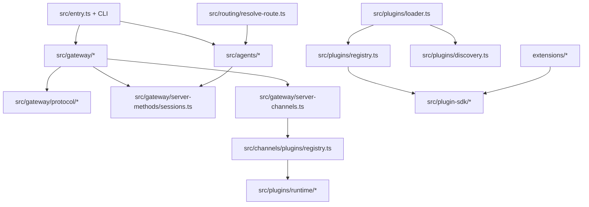
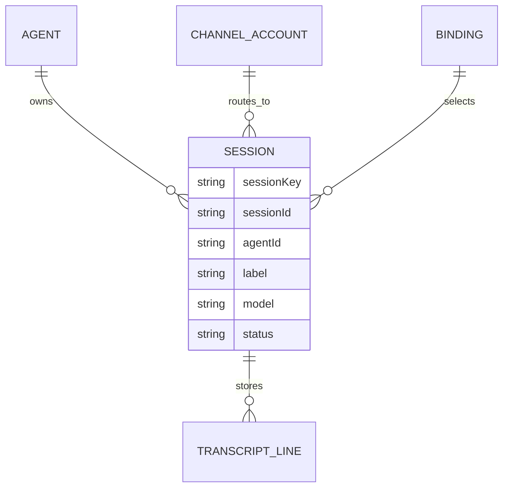
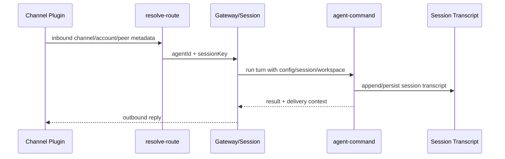

# OpenClaw 开源项目深度研究报告

- 仓库: https://github.com/openclaw/openclaw
- 研究日期: 2026-04-01
- 报告版本: v1.0
- 研究方式: 按 `prompts` 目录的 01-09 提示顺序，对本地代码、配置、文档和 GitHub 公共仓库页面做交叉核对

---

## Executive Summary

OpenClaw 是一个“个人 AI 助手运行时平台”，核心不是单一聊天机器人，而是一个把多渠道消息入口、Gateway 控制平面、Agent 运行时、插件 SDK、终端/网页/移动节点和工具系统整合在一起的本地优先系统。它面向的不是只想调用一个模型 API 的开发者，而是希望把“长期在线、可跨渠道、可调用工具、可接入设备能力”的 AI 助手部署到自己设备或受控环境中的高级用户、开发者和贡献者。证据见 `README.md:21-31`, `README.md:126-169`。

从工程成熟度看，这不是实验性 demo。它具备版本化发布、完整 CI、预提交安全扫描、插件契约、协议 schema、Docker/Fly.io/Render/K8s 部署清单以及 macOS/iOS/Android/Web 多端实现，已经是高复杂度、持续演进中的成熟开源平台。证据见 `package.json:3`, `.github/workflows/ci.yml:1-18`, `.pre-commit-config.yaml:7-157`, `Dockerfile:1-221`, `render.yaml:1-18`, `fly.toml:1-34`, `scripts/k8s/manifests/deployment.yaml:1-146`。

它最强的设计点是三层解耦。第一层是 Gateway 协议和服务端方法，把控制面动作统一成显式 schema 和 method handler；第二层是插件/Channel SDK，把“接入新渠道、新模型、新工具、新 Provider”的能力收敛到稳定契约；第三层是基于 session key、binding 和 agent workspace 的多 agent 路由。证据见 `src/gateway/protocol/AGENTS.md:1-13`, `src/gateway/protocol/schema/protocol-schemas.ts:177-319`, `src/plugins/AGENTS.md:1-18`, `src/plugin-sdk/AGENTS.md:1-28`, `src/routing/resolve-route.ts:39-59`, `src/routing/resolve-route.ts:731-803`。

但它也有明显成本。系统边界多、文件数大、运行模式多，导致理解门槛高；核心编排文件偏大，例如 `src/gateway/server.impl.ts` 约 1496 行、`src/plugins/loader.ts` 约 1410 行、`src/plugins/registry.ts` 约 1124 行、`src/agents/agent-command.ts` 约 912 行、`src/routing/resolve-route.ts` 约 804 行。这说明团队已经在通过边界文档和契约测试抵消复杂度，但维护成本仍然显著。证据见 `src/gateway/server.impl.ts`, `src/plugins/loader.ts`, `src/plugins/registry.ts`, `src/agents/agent-command.ts`, `src/routing/resolve-route.ts` 的文件规模，以及边界说明文件 `src/plugin-sdk/AGENTS.md:1-28`, `src/plugins/AGENTS.md:1-18`, `src/channels/AGENTS.md:1-14`。

如果你的目标是快速做一个单模型聊天应用，OpenClaw 过重；如果你的目标是构建“多渠道、多 Agent、可扩展、可部署、可审计”的个人 AI 助手平台，它的设计非常有参考价值。

---

## 1. 项目身份与定位

### 1.1 这个项目解决什么问题

OpenClaw 将“个人 AI 助手”拆成一个可部署平台：用户通过既有聊天渠道、CLI、WebChat、macOS/iOS/Android 节点与同一套 Gateway 和 Agent 系统交互，而不是为每个渠道单独实现一套机器人逻辑。README 直接把产品定义为“personal AI assistant”，并强调 Gateway 只是 control plane，真正的产品是 assistant 本身。证据见 `README.md:21-24`。

### 1.2 目标用户

更适合以下人群：

| 用户类型 | 适配度 | 原因 |
|---|---:|---|
| 个人高级用户 / 独立开发者 | 高 | 可把多个消息面和设备能力统一到一个私有 Gateway |
| 想做插件/渠道/模型扩展的贡献者 | 高 | Plugin SDK 与 extension 结构明确 |
| 只想做一个轻量聊天页面的人 | 低 | 系统过于重型，学习曲线陡峭 |
| DevOps/平台工程师 | 中高 | 提供 Docker/Fly/Render/K8s 路径与健康探针 |

证据见 `README.md:28-31`, `README.md:128-169`, `pnpm-workspace.yaml:1-6`。

### 1.3 成熟度判断

- 结论: `成熟中的生产级开源平台`
- 依据:
  - 明确版本号 `2026.3.28`，有 release/check/publish 脚本链路: `package.json:3`, `package.json:1114-1118`
  - 有完整 CI、额外安全快检、CodeQL、Docker 发布、平台发布工作流: `.github/workflows/ci.yml:1-320`, `.github/workflows`
  - 有安全策略、私有披露流程、明确 trust model: `SECURITY.md:1-207`
  - 有多环境部署产物: `Dockerfile:1-221`, `render.yaml:1-18`, `fly.toml:1-34`, `scripts/k8s/manifests/deployment.yaml:1-146`

### 1.4 关键指标

| 指标 | 结论 | 证据/备注 |
|---|---:|---|
| License | MIT | `package.json:10`, `README.md:18`, GitHub repo page `https://github.com/openclaw/openclaw` |
| 当前仓库版本 | `2026.3.28` | `package.json:3` |
| GitHub Stars | 约 `343k` | GitHub 仓库页面抓取 `https://github.com/openclaw/openclaw`，`turn1view0:L157-L159` |
| GitHub Forks | 约 `67.7k` | 同上，`turn1view0:L157-L159` |
| Commit 数 | `24,130` | GitHub 仓库页面抓取，`turn1view0:L194-L199` |
| Contributors | 数百级，无法从本地快照可靠精确化 | README 含大量贡献者墙；本地无 `.git` 历史可直接统计；仅 `.mailmap` 13 行不能代表总贡献者数 |
| 最近提交日期 | 本地快照无法可靠恢复 | 当前工作目录缺失 `.git` 元数据，GitHub 页面抓取未解析出时间戳 |

说明: GitHub 搜索结果缓存对 Stars/Forks 有冲突值，因此本报告采用直接打开仓库页时抓取到的数值，并将其视为 2026-04-01 的页面快照值。

---

## 2. 技术栈指纹

### 2.1 总体技术栈

| 层 | 技术 |
|---|---|
| 主语言 | TypeScript 为绝对主体，仓库中 `.ts` 文件约 8450 个 |
| 其他语言 | Swift、Kotlin、Shell、少量 Python/Go |
| 运行时 | Node.js 22.14+，README 推荐 Node 24 |
| 包管理 | pnpm 10.32.1，支持 bun 辅助运行 |
| 构建 | tsdown + 自定义脚本链 |
| 测试 | Vitest 为主，分 unit/gateway/extensions/contracts/e2e/live/docker lanes |
| UI | 独立 `ui/` 子包，另有 macOS/iOS/Android 客户端 |
| 网络协议 | WebSocket Gateway + HTTP 兼容接口 |
| 扩展模型 | Plugin SDK + bundled `extensions/*` |

证据见 `package.json:1009-1185`, `package.json:1272-1275`, `README.md:52-59`, `README.md:92-110`, `pnpm-workspace.yaml:1-6`。

### 2.2 语言与仓库形态

本地文件统计显示：

- `.ts`: 8450
- `.swift`: 583
- `.json`: 215
- `.kt`: 119
- `.md`: 87

这说明 OpenClaw 的主干是 TypeScript 单仓多包系统，原生客户端能力主要由 Swift 与 Kotlin 承担。

### 2.3 关键依赖

| 类别 | 代表依赖 | 作用 |
|---|---|---|
| CLI/交互 | `commander`, `@clack/prompts`, `osc-progress` | 命令行组织与交互 |
| HTTP/网关 | `express`, `hono`, `ws`, `undici` | Gateway HTTP/WS 与兼容接口 |
| 类型/校验 | `@sinclair/typebox`, `ajv`, `zod` | schema、校验、协议定义 |
| 插件/动态加载 | `jiti` | 插件/扩展加载 |
| 自动化/浏览器 | `playwright-core` | 浏览器控制与测试 |
| 图像/媒体 | `sharp`, `pdfjs-dist`, `file-type` | 媒体处理 |
| Agent 运行时 | `@mariozechner/pi-*` | Pi agent / coding agent / TUI / AI runtime |

证据见 `package.json:1188-1257`。

### 2.4 构建与测试链

- `pnpm build` 不是单一 tsc，而是一串构建脚本、A2UI 打包、runtime postbuild、Plugin SDK d.ts 生成和构建信息写入: `package.json:1009-1012`
- `pnpm check` 聚合类型检查、lint 和多类边界规则: `package.json:1017-1025`
- `pnpm test` 走自定义调度器 `scripts/test-parallel.mjs`: `package.json:1121`
- Vitest 强制使用 `forks` 池、按环境动态决定 worker 数，并把大量集成面从核心覆盖率中排除: `vitest.config.ts:47`, `vitest.config.ts:74-119`

### 2.5 运行时要求

- README 推荐 Node 24，最低 Node 22.16+: `README.md:52-59`, `README.md:65-79`
- `package.json` engine 实际要求 `>=22.14.0`: `package.json:1272-1275`
- 这是一个轻微文档/元数据差异。实际兼容边界应以 package engine 和测试矩阵为准，但对外说明以 README 的 22.16+ 更保守。

---

## 3. 高层架构

### 3.1 架构判断

- 仓库形态: Monorepo
- 运行形态: 单一核心运行时 + 多客户端/多插件/多渠道扩展
- 主要风格:
  - 插件化平台架构
  - 控制平面/数据平面分离
  - Schema-first Gateway 协议
  - 多 Agent / 多 Session 路由
  - 本地优先的文件系统持久化

证据:

- Monorepo workspace: `pnpm-workspace.yaml:1-6`
- Gateway 作为控制平面: `README.md:22`, `README.md:128`, `README.md:145`
- 协议边界: `src/gateway/protocol/AGENTS.md:1-13`
- 插件边界: `src/plugins/AGENTS.md:1-18`, `src/plugin-sdk/AGENTS.md:1-28`

### 3.2 ASCII 架构图

```text
                Messaging Channels / CLI / Web / macOS / iOS / Android
                                   |
                                   v
                        +----------------------+
                        |  Gateway Server      |
                        |  WS + HTTP Control   |
                        +----------------------+
                           |      |       |
                           |      |       +--> Control UI / WebChat / OpenAI-compatible HTTP
                           |      |
                           |      +--> Protocol schema + server-method handlers
                           |
                           +--> Channel Manager
                           |      +--> built-in / extension channel plugins
                           |
                           +--> Routing + Session model
                           |      +--> sessionKey / bindings / agent isolation
                           |
                           +--> Agent runtime
                           |      +--> Pi agent / ACP / tools / memory / model failover
                           |
                           +--> Plugin runtime + SDK
                                  +--> providers / tools / hooks / HTTP routes / channels
```

### 3.3 Mermaid 模块依赖图



### 3.4 分层说明

| 层 | 目录/文件 | 责任 | 观察到的跨层特点 |
|---|---|---|---|
| Entry / CLI | `src/entry.ts`, `src/cli/program/*` | 进程启动、命令注册、按需加载 | CLI 命令采用懒注册，避免一次性装载全部命令 |
| Gateway Protocol | `src/gateway/protocol/*` | 请求帧/事件帧/schema 定义 | 协议集中，变更成本可控 |
| Gateway Service | `src/gateway/server.impl.ts`, `src/gateway/server-methods.ts` | 启动服务、接入 WS/HTTP、分发 method | 这里汇总职责很多，是复杂度最高层 |
| Routing / Sessions | `src/routing/*`, `src/sessions/*`, `src/gateway/server-methods/sessions.ts` | agent 选择、session key、会话状态与 transcript | 路由规则精细，优先级明确 |
| Plugins / SDK | `src/plugins/*`, `src/plugin-sdk/*` | 插件发现、加载、注册、公开契约 | 扩展面广，但边界规则明确 |
| Channels | `src/channels/plugins/*`, `extensions/*` | 渠道接入、账号配置、收发消息、状态探针 | 内置与扩展渠道统一走插件模型 |
| Agents / Runtime | `src/agents/*` | Agent 执行、fallback、会话持久化、workspace | 与 session/routing 绑定紧密 |

证据见 `src/entry.ts:32-47`, `src/cli/program/build-program.ts:8-20`, `src/gateway/server-methods.ts:68-98`, `src/gateway/protocol/schema/protocol-schemas.ts:177-319`, `src/gateway/server-channels.ts:154-156`, `src/plugins/loader.ts:928-974`。

### 3.5 主要架构优点与债务信号

**优点**

- 契约化明显: 协议 schema、Plugin SDK subpath、channel/plugin contract tests 都不是隐式约定。证据见 `src/gateway/protocol/AGENTS.md:1-13`, `scripts/lib/plugin-sdk-entrypoints.json:1-220`, `src/plugins/contracts/registry.ts:1-220`
- 扩展面宽: 工具、Provider、Web Search、Speech、Channel、HTTP Route、CLI Registrar 都可由插件注册。证据见 `src/plugins/registry.ts:71-239`
- 渠道实现统一: 外部 channel 插件通过 `createChatChannelPlugin` 进入同一宿主模型。证据见 `extensions/bluebubbles/src/channel.ts:85-126`, `extensions/googlechat/src/channel.ts:135-179`

**债务/风险**

- 关键编排文件很大，说明系统中心复杂度偏高:
  - `src/gateway/server.impl.ts` 约 1496 行
  - `src/plugins/loader.ts` 约 1410 行
  - `src/plugins/registry.ts` 约 1124 行
  - `src/agents/agent-command.ts` 约 912 行
- `package.json` scripts 极其庞大，贡献者需要较强上下文才能选对 gate。证据见 `package.json:1009-1185`

---

## 4. 仓库结构地图

### 4.1 顶层目录说明

```text
.
├─ src/           核心 TypeScript 运行时，含 CLI、Gateway、插件、Agent、路由、会话
├─ extensions/    bundled 插件与扩展示例，含 channel/provider/tool 扩展
├─ apps/          macOS / iOS / Android 客户端
├─ ui/            Web Control UI 前端
├─ packages/      额外工作区包
├─ docs/          文档与生成文档基线
├─ scripts/       构建、CI、发布、协议生成、部署与检查脚本
├─ test/          独立测试目录
├─ vendor/        外部嵌入资产，例如 A2UI
└─ skills/        技能相关脚本/资源
```

证据见 GitHub 仓库页 `turn1view0:L201-L274`，以及本地目录扫描。

### 4.2 关键入口

| 类型 | 入口 | 说明 |
|---|---|---|
| CLI 进程入口 | `openclaw.mjs` -> `src/entry.ts` | CLI 包装入口 |
| 命令构建 | `src/cli/program/build-program.ts` | Commander program 构造 |
| 顶层命令注册 | `src/cli/program/command-registry.ts` | setup/onboard/config/message/agent/status 等命令 |
| Gateway 启动 | `src/gateway/server.ts` -> `src/gateway/server.impl.ts` | Gateway 实际服务装配 |
| 插件发现与加载 | `src/plugins/discovery.ts`, `src/plugins/loader.ts` | 插件候选查找、校验、加载、缓存 |
| Channel 运行时 | `src/gateway/server-channels.ts` | 统一管理渠道生命周期 |

### 4.3 重要配置文件

| 文件 | 作用 |
|---|---|
| `package.json` | 运行时元信息、exports、脚本、依赖、engine |
| `pnpm-workspace.yaml` | Monorepo workspace 划分 |
| `tsconfig.json` | TS NodeNext、strict、plugin-sdk path alias |
| `vitest.config.ts` | 测试 include/exclude、覆盖率、forks 策略 |
| `.env.example` | Gateway、模型、渠道的环境变量参考 |
| `.pre-commit-config.yaml` | 本地安全/格式/脚本检查 |
| `.github/workflows/ci.yml` | CI 主流水线 |

证据见 `pnpm-workspace.yaml:1-6`, `tsconfig.json:1-28`, `vitest.config.ts:1-169`, `.env.example:1-71`, `.pre-commit-config.yaml:7-157`, `.github/workflows/ci.yml:1-320`。

---

## 5. 核心模块与组件

### 5.1 模块清单

| 模块 | 主要职责 | 代表文件 |
|---|---|---|
| CLI Program | 命令树、help、懒加载命令注册 | `src/entry.ts`, `src/cli/program/build-program.ts`, `src/cli/program/command-registry.ts` |
| Gateway Protocol | 请求/响应/事件 schema | `src/gateway/protocol/schema.ts`, `src/gateway/protocol/schema/protocol-schemas.ts` |
| Gateway Server | HTTP/WS 服务、健康检查、插件/渠道/节点/会话编排 | `src/gateway/server.impl.ts`, `src/gateway/server-http.ts`, `src/gateway/server-methods.ts` |
| Plugins | discovery、loader、registry、runtime、contracts | `src/plugins/discovery.ts`, `src/plugins/loader.ts`, `src/plugins/registry.ts` |
| Plugin SDK | 对扩展作者暴露的稳定子路径与帮助器 | `src/plugin-sdk/core.ts`, `scripts/lib/plugin-sdk-entrypoints.json` |
| Channels | 渠道插件注册与生命周期管理 | `src/channels/plugins/registry.ts`, `src/gateway/server-channels.ts` |
| Routing | 依据 binding/channel/account/peer/guild/team 选择 agent 与 session | `src/routing/resolve-route.ts` |
| Agents | Agent 执行、workspace、fallback、会话绑定 | `src/agents/agent-command.ts` |
| Sessions | session schema、transcript、patch/list/reset/delete | `src/gateway/server-methods/sessions.ts`, `src/sessions/*` |

### 5.2 耦合情况

- **隔离较好**
  - Gateway 协议层与 handler 层分开: `src/gateway/protocol/schema/protocol-schemas.ts:177-319`, `src/gateway/server-methods.ts:68-157`
  - Plugin SDK 明确约束扩展只能走 `openclaw/plugin-sdk/*`: `src/plugin-sdk/AGENTS.md:1-28`
  - 渠道注册依赖 active plugin registry，而不是到处硬编码: `src/channels/plugins/registry.ts:36-78`

- **耦合偏高**
  - `src/gateway/server.impl.ts` 同时处理配置、auth、插件启动、channels、tailscale、health、wizard、sidecars
  - `src/agents/agent-command.ts` 直接承接 config/session/model/workspace/acp/fallback/delivery 多重职责

---

## 6. 功能清单与 Top 5 深入分析

### 6.1 主要功能清单

| 功能 | 描述 | 主要实现位置 | 暴露形式 |
|---|---|---|---|
| Onboarding | 引导配置 gateway、workspace、channels、skills | `README.md:28-31`, `src/cli/program/command-registry.ts:55-66` | CLI |
| Gateway 控制平面 | WS/HTTP 控制、会话、健康、模型、工具目录 | `src/gateway/server.impl.ts`, `src/gateway/server-methods.ts` | Gateway WS + HTTP |
| 多渠道收发 | WhatsApp/Telegram/Slack/Discord/Google Chat 等统一接入 | `README.md:128-135`, `src/gateway/server-channels.ts` | 渠道插件 |
| 多 Agent 路由 | 按 channel/account/peer/binding 路由到 agent workspace | `README.md:130`, `src/routing/resolve-route.ts` | 运行时 |
| 会话管理 | list/resolve/create/send/patch/reset/delete/compact | `src/gateway/protocol/schema/sessions.ts`, `src/gateway/server-methods/sessions.ts` | Gateway methods |
| 插件系统 | Provider、Tool、Channel、Hook、HTTP Route、CLI 扩展 | `src/plugins/registry.ts` | 插件运行时 |
| 节点能力 | node.invoke、设备配对、系统通知、画布/相机/屏幕能力 | `src/gateway/protocol/schema/protocol-schemas.ts:196-213` | Gateway methods/events |
| Web / Control UI | Control UI、WebChat、OpenAI-compatible HTTP endpoints | `src/gateway/server-http.ts:12-80` | HTTP |
| 安全与审核 | pairing、gateway auth、secret resolution、security audit | `README.md:112-124`, `SECURITY.md:1-207` | CLI + runtime |

### 6.2 Top 5 核心功能

#### 功能 1: CLI 懒加载命令系统

**入口**: `src/entry.ts` -> `src/cli/program/build-program.ts` -> `src/cli/program/command-registry.ts`

**流程**

1. `src/entry.ts:32-47` 先做 main module 守卫，避免二次启动副作用。
2. `src/entry.ts:69-155` 处理 respawn、profile、container、root version/help 快捷路径。
3. `src/cli/program/build-program.ts:8-20` 构造 Commander program 并注入上下文。
4. `src/cli/program/command-registry.ts:41-206` 定义核心命令描述。
5. `src/cli/program/command-registry.ts:220-233` 对命令使用 placeholder action，首次触发时才真正 import 对应 registrar。

**代表代码**

```ts
// src/cli/program/command-registry.ts:226-233
const placeholder = program.command(command.name).description(command.description);
placeholder.allowUnknownOption(true);
placeholder.allowExcessArguments(true);
placeholder.action(async (...actionArgs) => {
  removeEntryCommands(program, entry);
  await entry.register({ program, ctx, argv: process.argv });
  await reparseProgramFromActionArgs(program, actionArgs);
});
```

**设计取舍**

- 优点: 减少启动时一次性 import 的命令面，适合命令极多的 CLI。
- 风险: 命令发现和重解析链条更复杂，调试和 option collision 检查需要额外测试覆盖。

#### 功能 2: Gateway 方法分发与权限控制

**入口**: `src/gateway/server-methods.ts:39-157`

**流程**

1. `authorizeGatewayMethod` 按 role + scope 先做准入。
2. `coreGatewayHandlers` 汇总 connect/logs/channels/chat/config/sessions/node/agent 等 handler。
3. 对 `config.apply`, `config.patch`, `update.run` 额外做控制面写入限流。
4. 所有 handler 在 `withPluginRuntimeGatewayRequestScope` 中执行，保证插件运行时可回调 gateway。

**代表代码**

```ts
// src/gateway/server-methods.ts:104-110
const authError = authorizeGatewayMethod(req.method, client);
if (authError) {
  respond(false, undefined, authError);
  return;
}
if (CONTROL_PLANE_WRITE_METHODS.has(req.method)) {
  const budget = consumeControlPlaneWriteBudget({ client });
```

**设计取舍**

- 优点: 把协议方法、作用域授权和 rate limit 放在单一入口，非常清晰。
- 风险: 所有 Gateway method 汇总在单文件，后续继续膨胀会削弱可维护性。

#### 功能 3: 插件发现、加载与注册

**入口**: `src/plugins/discovery.ts`, `src/plugins/loader.ts`, `src/plugins/registry.ts`

**流程**

1. `src/plugins/discovery.ts:48-78` 用短 TTL 缓存 discovery，吸收启动高频 reload。
2. `src/plugins/discovery.ts:129-247` 对候选插件做 root escape、world-writable、ownership 等路径安全检查。
3. `src/plugins/loader.ts:276-305` 生成缓存上下文，按 workspace/plugins/env/scope 建立 registry cache key。
4. `src/plugins/loader.ts:928-974` 执行 discover + manifest registry + createPluginRegistry + active registry 激活。
5. `src/plugins/registry.ts:71-239` 将工具、渠道、provider、speech、media、HTTP routes、CLI registrars 等统一收集进 registry。

**代表代码**

```ts
// src/plugins/discovery.ts:138-149
if (isPathInside(rootRealPath, sourceRealPath)) {
  return null;
}
return {
  reason: "source_escapes_root",
  sourcePath: params.source,
  rootPath: params.rootDir,
  targetPath: params.source,
};
```

**设计取舍**

- 优点: 不是简单 `require()` 插件，而是先做 manifest-first 与路径安全校验，安全意识很强。
- 风险: Loader 复杂度很高，缓存、Jiti、manifest registry、runtime activation 叠加后理解成本大。

#### 功能 4: 渠道路由与多 Agent Session 选择

**入口**: `src/routing/resolve-route.ts`

**流程**

1. 输入包含 `channel/accountId/peer/parentPeer/guildId/teamId/memberRoleIds`。
2. `matchedBy` 定义了完整优先级层级: peer -> parent peer -> guild+roles -> guild -> team -> account -> channel -> default。
3. 命中后构造内部 `sessionKey` 与 `mainSessionKey`，并确定 `lastRoutePolicy`。
4. 没有 binding 时回退到默认 agent。

**关键证据**

- 匹配维度定义: `src/routing/resolve-route.ts:50-58`
- tier 优先级: `src/routing/resolve-route.ts:731-803`
- session key 构造: `src/routing/resolve-route.ts:91-112`

**设计取舍**

- 优点: 对复杂企业/群聊/多账号路由场景支持很强。
- 风险: 路由规则一旦增多，配置可理解性与排障复杂度都会升高。

#### 功能 5: Session 管理与 transcript 持久化

**入口**: `src/gateway/protocol/schema/sessions.ts`, `src/gateway/server-methods/sessions.ts`

**流程**

1. `src/gateway/protocol/schema/sessions.ts:4-186` 先定义 sessions.list/resolve/create/send/patch/reset/delete/compact/usage 的 schema。
2. `src/gateway/server-methods/sessions.ts:132-199` 会向订阅连接广播 `sessions.changed`。
3. `src/gateway/server-methods/sessions.ts:228-257` 确保 transcript 文件存在，并以 JSONL header 初始化。
4. transcript 文件默认 `mode: 0o600`，表明默认是本地私有文件权限。
5. 会话中断会复用 `chat.abort`，而不是另写一套取消逻辑。证据见 `src/gateway/server-methods/sessions.ts:303-359`

**代表代码**

```ts
// src/gateway/server-methods/sessions.ts:243-255
if (!fs.existsSync(transcriptPath)) {
  fs.mkdirSync(path.dirname(transcriptPath), { recursive: true });
  const header = {
    type: "session",
    version: CURRENT_SESSION_VERSION,
    id: params.sessionId,
    timestamp: new Date().toISOString(),
    cwd: process.cwd(),
  };
  fs.writeFileSync(transcriptPath, `${JSON.stringify(header)}\n`, {
    encoding: "utf-8",
    mode: 0o600,
  });
}
```

**设计取舍**

- 优点: 默认文件系统落盘非常直接，便于本地优先与调试。
- 风险: 当会话数、消息量、并发 Agent 数增长时，文件系统扫描和 JSONL 操作可能成为性能瓶颈。

### 6.3 横切关注点

| 关注点 | 实现方式 | 证据 | 评价 |
|---|---|---|---:|
| 日志 | subsystem logger、按域拆分 | `src/gateway/server.impl.ts:161-180`, `src/plugins/loader.ts:146` | 4/5 |
| 权限/鉴权 | Gateway role + scope、HTTP auth、DM pairing | `src/gateway/server-methods.ts:39-66`, `README.md:112-124`, `SECURITY.md:112-170` | 5/5 |
| 插件边界 | Plugin SDK 子路径 + boundary docs + contract registry | `src/plugin-sdk/AGENTS.md:1-28`, `scripts/lib/plugin-sdk-entrypoints.json:1-220` | 5/5 |
| 输入校验 | TypeBox schema + protocol validator | `src/gateway/protocol/schema/protocol-schemas.ts:177-319`, `src/gateway/protocol/schema/sessions.ts:4-186` | 5/5 |
| 缓存 | discovery cache、plugin registry cache、route cache | `src/plugins/discovery.ts:48-78`, `src/plugins/loader.ts:119-195`, `src/routing/resolve-route.ts:201-212` | 4/5 |
| 错误处理 | errorShape、fail-fast startup、HTTP 统一失败响应 | `src/gateway/server-methods.ts:49-64`, `src/gateway/server.impl.ts:244-259`, `src/gateway/server-http.ts:122-126` | 4/5 |

---

## 7. 数据模型、数据流与持久化

### 7.1 数据模型概览

系统没有显式关系型数据库作为主存储。默认核心状态由以下部分组成：

- `openclaw.json` 等配置文件
- session store
- session transcript JSONL 文件
- 插件/技能/工作区目录

证据见 `.env.example:1-24`, `src/gateway/server-methods/sessions.ts:228-257`。

### 7.2 会话模型 Mermaid



### 7.3 主要数据流

#### Flow 1: 入站消息到 Agent 回复



支撑证据:

- 路由匹配与 session key: `src/routing/resolve-route.ts:91-112`, `src/routing/resolve-route.ts:731-803`
- agent 执行准备、session 解析、workspace 保证: `src/agents/agent-command.ts:154-325`
- transcript 初始化与广播: `src/gateway/server-methods/sessions.ts:132-199`, `src/gateway/server-methods/sessions.ts:228-257`

#### Flow 2: 插件加载

```text
discover candidates
  -> manifest registry
  -> path safety checks
  -> create plugin registry
  -> activate runtime registry
  -> channels/providers/tools/hooks available
```

证据见 `src/plugins/discovery.ts:129-247`, `src/plugins/loader.ts:928-974`, `src/plugins/registry.ts:219-239`。

#### Flow 3: Gateway 请求生命周期

```text
WS/HTTP request
  -> protocol schema / validated params
  -> role + scope authorization
  -> handler lookup
  -> plugin runtime request scope
  -> business handler
  -> response / event broadcast
```

证据见 `src/gateway/server-methods.ts:39-157`, `src/gateway/protocol/schema/protocol-schemas.ts:177-319`。

### 7.4 持久化层

| 存储类型 | 技术 | 用途 | 证据 |
|---|---|---|---|
| 配置存储 | 本地 JSON / env | gateway auth、channels、providers、agents | `.env.example:1-71`, `src/gateway/server.impl.ts:261-309` |
| 会话存储 | 本地 session store + transcript JSONL | 会话索引、消息历史 | `src/gateway/server-methods/sessions.ts:228-257` |
| 插件元数据 | manifest + generated metadata | 插件发现与注册 | `src/plugins/discovery.ts:5-21`, `src/plugins/loader.ts:928-974` |
| 可选向量/记忆能力 | 依赖和插件能力存在，但默认主路径非 DB-first | memory/embedding/provider 扩展 | `package.json:1225`, `src/plugins/registry.ts:18-27` |

### 7.5 数据安全与隐私

- Gateway 明确采用单用户 trusted-operator 模型，而不是多租户隔离模型: `SECURITY.md:112-170`
- transcript 文件初始化时权限为 `0o600`: `src/gateway/server-methods/sessions.ts:252-255`
- 插件发现会阻止 world-writable 或越界路径: `src/plugins/discovery.ts:151-258`
- Web 界面默认建议 loopback-only，不建议公网暴露: `SECURITY.md:177-207`

---

## 8. 工程实践与技术评估

### 8.1 工程评分卡

| 维度 | 评级 | 证据 |
|---|---|---|
| 代码风格一致性 | Excellent | `package.json:1017-1025`, `.pre-commit-config.yaml:127-156` |
| 类型安全 | Excellent | `tsconfig.json:10-19` |
| 测试基础设施 | Excellent | `vitest.config.ts:47-119`, `package.json:1121-1179` |
| CI/CD | Excellent | `.github/workflows/ci.yml:19-320` |
| 安全治理 | Excellent | `SECURITY.md:1-207`, `.pre-commit-config.yaml:24-97` |
| 文档完整度 | Good | README、CONTRIBUTING、SECURITY、部署清单都齐全 |
| 复杂度控制 | Adequate | 有边界文档，但核心文件仍偏大 |
| 社区健康 | Good | issue templates、PR template、CODEOWNERS、labeler 齐全 |

### 8.2 测试策略分析

- 全仓文件约 `9471`
- 测试文件约 `3162`
- 说明测试密度很高，但并非所有测试都是 unit；项目明确按 surface 切分成 gateway/extensions/contracts/e2e/live/docker 多条 lane。证据见 `package.json:1121-1179`
- Vitest 使用 `forks`，并按 CI/本地动态配置 worker；coverage 只对 `src/**/*.ts` 生效，且排除大量集成面，说明团队有意识地区分“核心可单测逻辑”和“依赖 e2e/manual/contract 的复杂集成面”。证据见 `vitest.config.ts:47`, `vitest.config.ts:74-119`

### 8.3 DevOps/CI 评估

- CI 的 preflight 会先做 scope detection，再按变更范围展开不同矩阵任务，而不是简单全量跑。证据见 `.github/workflows/ci.yml:20-133`
- 单独有 `security-fast` job 跑 pre-commit、detect-private-key、zizmor、pnpm audit。证据见 `.github/workflows/ci.yml:134-229`
- 构建产物 `dist` 和 A2UI bundle 会被上传共享给后续任务。证据见 `.github/workflows/ci.yml:231-279`

### 8.4 安全实践评估

强项：

- 明确威胁模型与 out-of-scope，而不是只给邮箱地址: `SECURITY.md:1-207`
- 把“插件是 trusted computing base”说得很清楚，减少错误安全预期: `SECURITY.md:147-170`
- 默认 loopback、pairing、文件权限、防世界可写插件路径、HTTP 面安全建议都具备

风险：

- 系统功能面过广，审计面自然很大
- 单用户 trust model 对新使用者来说容易被误解成“天然多租户安全”

### 8.5 与同类项目的粗比较

| 维度 | OpenClaw | 轻量 Bot 框架 | 单纯 LLM SDK |
|---|---|---|---|
| 多渠道接入 | 很强 | 中 | 弱 |
| Agent/session 编排 | 很强 | 弱 | 弱 |
| 插件契约 | 很强 | 中 | 中 |
| 学习曲线 | 高 | 中 | 低 |
| 私有部署/运维面 | 强 | 中 | 弱 |
| 适合作为平台底座 | 强 | 中 | 弱 |

---

## 9. 部署与运维指南

### 9.1 环境要求

| 项目 | 最低/建议 | 证据 |
|---|---|---|
| Node.js | 最低 `>=22.14.0`，README 建议 `24` | `package.json:1272-1275`, `README.md:52-59` |
| 包管理 | pnpm 10.32.1 | `package.json:1275` |
| 本地状态目录 | `~/.openclaw` 或自定义 `OPENCLAW_STATE_DIR` | `.env.example:1-24` |
| 网络端口 | 默认 18789，Docker 映射 18789/18790 | `README.md:72-78`, `docker-compose.yml:21-22` |

### 9.2 支持的部署方式

#### 本地开发

```bash
pnpm install
pnpm ui:build
pnpm build
pnpm openclaw onboard --install-daemon
pnpm gateway:watch
```

证据见 `README.md:92-110`。

#### Docker

- 多阶段构建
- 基础镜像固定 digest
- 运行时默认非 root `node`
- 自带 `HEALTHCHECK /healthz`
- 可选浏览器、Docker CLI、扩展依赖

证据见 `Dockerfile:1-221`。

#### Docker Compose

- 分为 `openclaw-gateway` 与 `openclaw-cli`
- Gateway 默认 `--bind lan`
- 数据目录和 workspace 通过 volume 挂载

证据见 `docker-compose.yml:1-58`。

#### Render / Fly.io / K8s

- Render: Docker runtime + 持久盘 + 自动生成 Gateway token，`/health` 作为健康检查。证据见 `render.yaml:1-18`
- Fly.io: `dist/index.js gateway --allow-unconfigured --port 3000 --bind lan`。证据见 `fly.toml:17-34`
- K8s: `readOnlyRootFilesystem`, `drop ALL capabilities`, liveness/readiness probes, PVC + ConfigMap。证据见 `scripts/k8s/manifests/deployment.yaml:18-146`

### 9.3 配置参考

高频环境变量来自 `.env.example`：

| 配置项 | 类型 | 必需性 | 说明 |
|---|---|---|---|
| `OPENCLAW_GATEWAY_TOKEN` | string | 建议必配 | Gateway token |
| `OPENCLAW_GATEWAY_PASSWORD` | string | 二选一 | 另一种 auth 模式 |
| `OPENCLAW_STATE_DIR` | path | 可选 | 状态目录 |
| `OPENAI_API_KEY` / `ANTHROPIC_API_KEY` / `GEMINI_API_KEY` | string | 至少一项 | 模型提供商凭据 |
| `TELEGRAM_BOT_TOKEN` / `DISCORD_BOT_TOKEN` / `SLACK_BOT_TOKEN` 等 | string | 按需 | 各渠道凭据 |
| `ELEVENLABS_API_KEY` / `DEEPGRAM_API_KEY` | string | 可选 | 语音/媒体能力 |

证据见 `.env.example:11-71`。

### 9.4 运维关注点

- 健康探针: `/health`, `/healthz`, `/ready`, `/readyz`，在 HTTP 层有显式实现。证据见 `src/gateway/server-http.ts:128-133`, `src/gateway/server-http.ts:224-260`
- Docker 与 K8s 都已内置 liveness/readiness 检查。证据见 `Dockerfile:214-221`, `scripts/k8s/manifests/deployment.yaml:106-123`
- Channel lifecycle 有重启退避和健康监控开关。证据见 `src/gateway/server-channels.ts:18-25`, `src/gateway/server-channels.ts:194-224`

### 9.5 常见坑

1. README 说最低 Node 22.16+，`package.json` engine 是 22.14.0，使用者可能混淆兼容底线。
2. Docker 默认 CMD 绑定 loopback，但 `docker-compose.yml` 显式改成 `lan`；这符合容器对外暴露需求，但部署时必须同步配置 auth。
3. 项目安全模型不是多租户隔离，企业共享部署若理解错误，容易带来越权预期偏差。

---

## 10. 学习路径与阅读顺序

### 10.1 前置知识

**必备**

- TypeScript + Node ESM
- WebSocket/HTTP API 基础
- CLI 工程基础
- 文件系统持久化与配置管理

**建议**

- 插件架构与契约设计
- 消息机器人/聊天渠道集成经验
- 多 Agent / session routing 概念

### 10.2 四阶段学习路线

#### Phase 1: 定位项目

- [ ] 读 `README.md`
- [ ] 读 `CONTRIBUTING.md`
- [ ] 读 `SECURITY.md`
- [ ] 跑通 `pnpm install && pnpm ui:build && pnpm build`

目标: 能用两句话解释 OpenClaw 是“多渠道个人 AI 助手平台”，不是单一 bot。

#### Phase 2: 理解入口与 Gateway

- [ ] 读 `src/entry.ts`
- [ ] 读 `src/cli/program/build-program.ts`
- [ ] 读 `src/cli/program/command-registry.ts`
- [ ] 读 `src/gateway/server.ts`
- [ ] 读 `src/gateway/server.impl.ts`
- [ ] 读 `src/gateway/server-methods.ts`

目标: 能解释 CLI 如何进入 Gateway，Gateway 如何把 method 分发到 handler。

#### Phase 3: 理解插件与渠道

- [ ] 读 `src/plugins/AGENTS.md`
- [ ] 读 `src/plugin-sdk/AGENTS.md`
- [ ] 读 `src/plugins/discovery.ts`
- [ ] 读 `src/plugins/loader.ts`
- [ ] 读 `src/plugins/registry.ts`
- [ ] 读一个渠道插件样例:
  - `extensions/bluebubbles/src/channel.ts`
  - `extensions/googlechat/src/channel.ts`

目标: 能解释“新增一个渠道或 Provider 要接到哪里”。

#### Phase 4: 理解路由与会话

- [ ] 读 `src/routing/resolve-route.ts`
- [ ] 读 `src/gateway/protocol/schema/sessions.ts`
- [ ] 读 `src/gateway/server-methods/sessions.ts`
- [ ] 读 `src/agents/agent-command.ts`

目标: 能从一次消息进入，到 session key 决定、agent workspace 选择、transcript 落盘，把全链路串起来。

### 10.3 推荐代码阅读顺序

1. `README.md`
2. `src/entry.ts`
3. `src/cli/program/command-registry.ts`
4. `src/gateway/server-methods.ts`
5. `src/gateway/protocol/schema/protocol-schemas.ts`
6. `src/plugins/discovery.ts`
7. `src/plugins/loader.ts`
8. `src/plugins/registry.ts`
9. `src/channels/plugins/registry.ts`
10. `src/routing/resolve-route.ts`
11. `src/gateway/server-methods/sessions.ts`
12. `src/agents/agent-command.ts`

### 10.4 Quick Win

最快见效的路径不是改业务逻辑，而是:

1. 跑 `openclaw onboard`
2. 启动 `openclaw gateway`
3. 用 `openclaw agent --message "hello"` 跑通一轮
4. 然后追踪 `src/entry.ts` -> `src/cli/program/*` -> `src/gateway/*`

这样能最快建立“命令入口、Gateway、session、agent”四者关系。

---

## 11. 结论与建议

### 11.1 最适合借鉴的部分

1. 插件边界管理做得非常成熟，尤其是 Plugin SDK 子路径与边界文档协同。
2. Gateway 协议 schema-first，适合需要长期演进的控制平面。
3. 路由与 session 设计细粒度，适合复杂多渠道 AI 助手场景。
4. 安全文档不是空壳，而是直接约束了 trust model 和报告边界。

### 11.2 最值得警惕的部分

1. 核心装配文件过大，未来继续增量开发时要防止“上帝模块”继续膨胀。
2. 用户若误把它当多租户 SaaS 中台，会在安全与授权上产生错误预期。
3. 新贡献者首次进入时容易在脚本矩阵、渠道矩阵、插件矩阵里迷路。

### 11.3 综合判断

OpenClaw 不是“如何写一个 bot”的案例，而是“如何把个人 AI 助手平台产品化”的案例。它最值得研究的不是某个算法，而是协议、插件、渠道、路由、会话、部署、安全模型如何在一个大型 TypeScript monorepo 内协同落地。

---

## TL;DR

- OpenClaw 是一个本地优先、插件化、多渠道、多 Agent 的个人 AI 助手平台，不是轻量聊天 demo。
- 核心技术骨架是 `Gateway protocol + server-method handlers + plugin SDK + channel plugins + session routing`。
- 默认主持久化不是数据库，而是配置文件与 session transcript 文件系统存储。
- 工程成熟度很高，CI、安全、部署、协议、插件契约都比较完整，但系统复杂度也很高。
- 最值得借鉴的是插件边界设计、schema-first 控制平面和多渠道/多会话路由模型。
